<p align="center">
  
</p>

<h1 align="center">NuphyBar</h1>

<p align="center">Show local AI agent status on a NuPhy keyboard's side lights.</p>

<p align="center">
  <a href="README.md">中文</a> ·
  <a href="https://github.com/itsmaiGe/NuphyBar/releases/latest">Download</a> ·
  <a href="https://x.com/unflwMaige">Maige on X</a>
</p>

NuphyBar is a lightweight native macOS menu-bar app. It receives lifecycle events from Codex, Claude Code, OpenCode, and other local agents, sends a standard Bluetooth keyboard LED output report when the state changes, and lets custom keyboard firmware render the animation locally.

It never reads keystrokes and does not stream animation frames over Bluetooth. The Mac sends one two-byte report per state change; the keyboard renders every animation frame itself.

> [!IMPORTANT]
> The firmware in the current Release is **only for the NuPhy Air60 V2 ANSI**. Never flash the Air60 V2 binary to an Air75 V2, Air96 V2, Halo, Gem80, or any other model. A firmware image for the wrong model can make the keyboard unusable.

## Light states

| Agent state | Air60 V2 right side light |
|---|---|
| Idle | No override; stock rainbow/battery effect returns |
| Working | A continuous blue brightness wave moves across all five LEDs |
| Waiting/error | An amber double pulse on all five LEDs |
| Complete | A green breathing effect on all five LEDs |

The stock cyan Caps Lock indicator remains on the left side. Agent state only uses the right side light.

## Keyboard compatibility

### Implemented and physically verified

| Model | Transport | Status | Light area |
|---|---|---|---|
| **Air60 V2 ANSI** | Bluetooth Low Energy | Supported | Five right-side RGB LEDs |

Bluetooth typing, the left Caps Lock indicator, every Agent state, reconnection, and sustained typing stability have been tested on real hardware.

### Port-ready, but each model needs its own firmware

| Model | Expected effort | Why |
|---|---:|---|
| **Air75 V2** | Low to medium | Same Air V2 QMK family and the same left/right side-light roles |
| **Air96 V2** | Low to medium | Same Air V2 QMK family; NuPhy's own firmware already maps Num Lock to the right side light |

These models can reuse NuphyBar's HID state protocol and effect model, but their LED indices, function addresses, firmware baseline, and memory layout must be verified independently. **The Air60 V2 `.bin` cannot be reused.**

### Feasible with model-specific visual design

| Model | Available lighting | Notes |
|---|---|---|
| Halo65 V2 QMK | Halolight / nameplate | Needs a ring or segmented effect rather than a five-step bar |
| Halo75 V2 QMK | Halolight / nameplate | Requires model-specific firmware and effects |
| Halo96 V2 QMK | Halolight / right light | NuPhy's firmware already contains a right-side Num Lock indication path |
| Gem80 tri-mode | RGB light bar / nameplate | Only the Bluetooth-capable tri-mode variant is in scope |

### Not currently supported

- Air V1, Halo V1, Field75, and other models on the older NuPhy firmware line;
- Air60 HE, Air75 HE, Field75 HE, and other HE/IO models;
- Air V3, Halo V2 IO, Kick75 IO, BH65, and other NuPhy IO products;
- the wired-only Gem80, because the current app implements BLE HID output only.

NuPhy IO and QMK are different firmware stacks. Having a light bar is not sufficient for this patch. See NuPhy's [firmware catalog](https://nuphy.com/pages/firmware) and [QMK firmware releases](https://nuphy.com/pages/qmk-firmwares).

## Architecture

```mermaid
flowchart LR
    A["Codex / Claude Code / OpenCode / other agents"] -->|Hook or local plugin| B["agent-light helper"]
    B -->|coarse lifecycle state only| C["local state file"]
    C --> D["NuphyBar menu-bar app"]
    D -->|2-byte HID output report on state changes| E["macOS IOHID"]
    E -->|Bluetooth LE| F["NuPhy wireless module"]
    F -->|stock UART status field| G["STM32 / QMK firmware"]
    G -->|local frame rendering| H["right RGB side light"]
```



### Standard keyboard LED bits as the state protocol

NuphyBar does not add a private BLE GATT service. It reuses the keyboard's existing standard LED output report:

| HID bit | Value | NuphyBar meaning |
|---|---:|---|
| Num Lock | `0x01` | Working |
| Caps Lock | `0x02` | Reserved for the stock left Caps indicator |
| Scroll Lock | `0x04` | Waiting/error |
| Num + Scroll | `0x05` | Complete |
| No Num/Scroll | `0x00` | Idle; restore the stock effect |

The Mac sends `[Report ID 1, state mask]`. Caps Lock is added independently, so the stock left indicator remains functional.

Only the Num and Scroll bits are available, so the safe protocol supports three non-idle states. Error and waiting intentionally share the amber attention effect. A distinct fourth state would require a new wireless protocol rather than another value in this two-bit channel.

### Why the final design does not freeze the keyboard

Early experiments increased wireless polling and transmitted multi-frame commands. Real hardware eventually froze the light strip and stopped typing. The release design removes that failure mode:

- Agent hooks only update a local state file;
- NuphyBar aggregates sessions once per second;
- it sends one HID report only when the final display state changes;
- the keyboard retains NuPhy's stock wireless polling interval;
- all waves, pulses, and breathing frames are generated from a local keyboard timer.

Animation frame rate no longer consumes the Bluetooth HID path used for typing.

## Air60 V2 release firmware

`stable-v7` is not a rebuild of an older public QMK tree. It applies an audited minimal hook to NuPhy's official Air60 V2 v2.1.5 firmware:

- official baseline SHA-256: `cd0425f548a01416d1c3c25208ff74867fffd20165520c7c2eaa56000ff347bf`
- NuphyBar firmware SHA-256: `c573c7939a53994b50f29313744f27f9af30b90cd064f13fc019f87710b89ac0`
- only four official bytes at `0x080028EA–0x080028ED` are changed;
- those bytes redirect the original `sys_led_show()` call to a hook at `0x08010E00`;
- the hook calls the original `sys_led_show()` first, preserving Caps Lock;
- USB and idle states return without overriding stock behavior;
- the added effect code is 332 bytes and uses no `.data` or `.bss`;
- UART, RF polling, key reports, sleep, pairing, and USB input are untouched;
- the builder verifies machine-code signatures at critical official functions and refuses the wrong baseline;
- the verifier proves that only the call site and appended hook differ from the official image.

The source, reproducible builder, and tests are in [`firmware/air60-v2`](firmware/air60-v2).

> [!NOTE]
> While an Agent is active, its state temporarily replaces the right-side battery indication. Stock battery/rainbow lighting returns at idle. Do not rely on the right side light as your only battery check during a long task.

## Install NuphyBar

Requirements:

- macOS 14 or later;
- an Apple Silicon Mac;
- a NuPhy keyboard with compatible custom firmware;
- a Bluetooth Low Energy keyboard connection, not USB.

Steps:

1. Download `NuphyBar-0.5.8-macOS-arm64.dmg` from [Releases](https://github.com/itsmaiGe/NuphyBar/releases/latest).
2. Open the DMG and drag NuphyBar to Applications.
3. On first launch, if macOS blocks the app, Control-click it and choose Open, or approve it in System Settings → Privacy & Security.
4. Grant Input Monitoring when prompted. This allows HID output to the keyboard; NuphyBar does not read or store keystrokes.
5. Reopen NuphyBar and confirm the exact keyboard model and Bluetooth connection on the Keyboard tab.
6. Enable the desired integrations on the Agent tab, then start a new task in that agent.

The first public DMG is ad-hoc signed and is not yet notarized with an Apple Developer ID. Its full source, build script, and checksums are public.

## Agent integrations

| Agent | Integration | Main lifecycle events |
|---|---|---|
| Codex | `~/.codex/hooks.json` | prompt submit, permission, tool completion, stop |
| Claude Code | `~/.claude/settings.json` | prompt, permission, input notification, tool completion, session end |
| OpenCode | global local plugin | busy, idle, error, permission |
| Grok Build | personal hooks file | prompt, tool, failure, permission, stop |
| Hermes | local lifecycle plugin | LLM call, approval, session completion |
| OpenClaw | managed local hook | message received, result sent, stop |

The installer changes only entries that it owns or marks. It refuses to overwrite an unmarked user file with the same name. Codex may still ask you to trust each newly installed hook.

Display priority is:

```text
error/waiting > working > complete > idle
```

One completed session never hides another session that is still working. Completion is retained for about 15 seconds, and stale active sessions are pruned automatically.

## Flash the Air60 V2 firmware

Read [`firmware/air60-v2/README.md`](firmware/air60-v2/README.md) first. In short:

1. Verify that the keyboard is a **NuPhy Air60 V2 ANSI**.
2. Export the current VIA keymap.
3. Download `NuphyBar-Air60-V2-stable-v7.bin` and verify its SHA-256.
4. Keep NuPhy's [official Air60 V2 v2.1.5 recovery firmware](https://nuphy.com/pages/qmk-firmwares) ready.
5. Connect USB and enter STM32 DFU. The NuPhy/QMK source documents holding the top-left Esc key while plugging in; you can also follow [NuPhy's update instructions](https://nuphy.com/pages/update-instructions).
6. Select the correct `.bin` in [QMK Toolbox](https://github.com/qmk/qmk_toolbox/releases) and flash it. Never unplug or power off during the write.
7. Restart, switch back to Bluetooth, verify typing and Caps Lock first, then test NuphyBar states.

Advanced users may use the following only after confirming that the detected STM32 DFU device is the intended keyboard:

```bash
dfu-util -a 0 -s 0x08000000:leave -D NuphyBar-Air60-V2-stable-v7.bin
```

Flashing is a destructive checkpoint. Never let a script infer the model, and never begin without a recovery image.

## Build the macOS app

Requires macOS 14+ and the Swift 6.1 toolchain.

```bash
git clone https://github.com/itsmaiGe/NuphyBar.git
cd NuphyBar
swift test
./script/package_release.sh
```

The DMG is written to `dist/NuphyBar-0.5.8-macOS-arm64.dmg`.

To build, install, and run locally:

```bash
./script/build_and_run.sh
```

## Rebuild the firmware

Install the build tools:

```bash
brew install arm-none-eabi-gcc@8 arm-none-eabi-binutils dfu-util
```

Download NuPhy's official Air60 V2 ANSI v2.1.5 firmware and run:

```bash
./firmware/air60-v2/build.sh \
  /path/to/QMK_firmware_nuphy_air60_v2_ansi_v2.1.5.bin
```

The build runs effect and Thumb branch tests, validates the official baseline, compiles the hook, adds the DFU suffix, and verifies the final layout. GCC 8.5.0 reproduces the `stable-v7` Release binary byte for byte.

## Ask Codex or Claude Code to port/flash firmware

Ready-to-use local coding-agent prompts and mandatory safety checkpoints are provided here:

- [中文：让 AI 编写、移植和刷写固件](docs/AI_FIRMWARE_GUIDE.zh-CN.md)
- [English: AI-assisted firmware porting and flashing](docs/AI_FIRMWARE_GUIDE.en.md)

AI may inspect source, implement effects, run tests, and compile. **Entering DFU, confirming the exact model, and authorizing the final flash must remain a separate human confirmation step.**

## Privacy and security

- no keystroke reading, logging, or uploading;
- hooks send only the provider, coarse state, and a local session identifier;
- the state file stays local and contains no prompts or responses;
- no cloud service, analytics SDK, or background network API;
- config edits preserve unrelated user settings and refuse unmarked conflicts.

See [`SECURITY.md`](SECURITY.md). Never attach sensitive local configuration to a public issue.

## Repository layout

```text
Sources/
  AgentLightApp/      macOS menu app and settings UI
  AgentLightCore/     state aggregation, hook mapping, integration installer
  AgentLightHID/      NuPhy BLE HID discovery and output reports
  AgentLightCLI/      short-lived helper bundled inside the app
firmware/air60-v2/    stable-v7 hook, builder, verifier, and tests
Design/               source artwork for the app and menu-bar logos
script/               app build, local install, and DMG packaging
Tests/                Swift tests
```

## License

- macOS app, ordinary project scripts, and documentation: [`MIT`](LICENSE)
- QMK/NuPhy-derived code and patches under `firmware/`: [`GPL-2.0-or-later`](firmware/LICENSE-GPL-2.0-or-later.md)
- third-party Agent icons and trademarks belong to their owners and are used only for identification; see [`THIRD_PARTY_NOTICES.md`](THIRD_PARTY_NOTICES.md).

NuphyBar is a community project and is not affiliated with or endorsed by NuPhy, OpenAI, Anthropic, or any other agent vendor.

## Author

Maige · [Follow me on X](https://x.com/unflwMaige)
