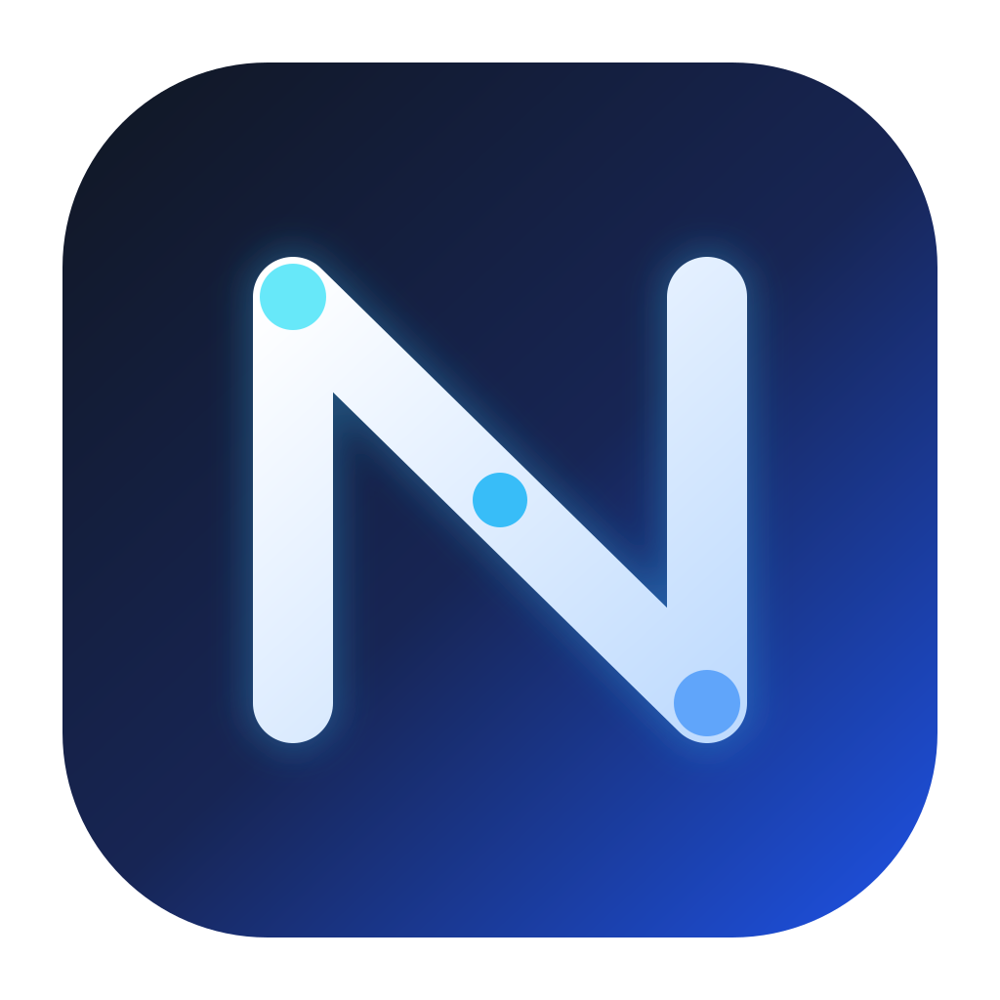
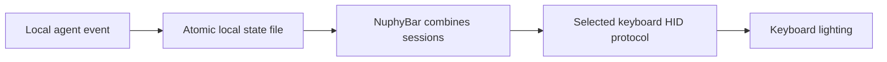

<p align="center">
  
</p>

<h1 align="center">NuphyBar</h1>

<p align="center">See your local AI agent's status on your keyboard.</p>

<p align="center">
  <a href="README.zh-CN.md">简体中文</a> ·
  <a href="https://github.com/itsmaiGe/NuphyBar/releases">Releases</a> ·
  <a href="https://x.com/Samoye">Maige on X</a>
</p>

NuphyBar is a small native macOS menu-bar app. It combines lifecycle events from local agents such as Codex and Claude Code, then displays working, waiting, completion, and error states through compatible keyboard lighting. NuPhy keyboards render animations in firmware; the AULA F99 Pro displays solid colors using its stock firmware.

It does not read keystrokes, save prompts or responses, or send data to a server.

## Choose the right version

| Version | What it includes |
|---|---|
| [Published v0.5.9](https://github.com/itsmaiGe/NuphyBar/releases/tag/v0.5.9) | Air60 V2 ANSI over Bluetooth; downloadable macOS app and `stable-v7` firmware |
| Current source, app version 0.5.13 | Adds Halo75 V2 ANSI USB/Bluetooth, AULA F99 Pro Bluetooth, richer states, and recovery diagnostics; build from source |

The Halo75 and AULA additions are **not included in the v0.5.9 download**. Their contributor-reported hardware checks and remaining release checks are described below. Source availability is not a new binary release.

## Keyboard compatibility

| Exact model | Connection | Required firmware | Lighting | Validation |
|---|---|---|---|---|
| NuPhy Air60 V2 ANSI | Bluetooth Low Energy | NuphyBar `stable-v7` | Five right-side LEDs | Released; physically verified |
| NuPhy Halo75 V2 ANSI **QMK** | USB Raw HID | Dedicated Halo75 overlay | Five upper-left LEDs | Experimental; tested by contributor |
| NuPhy Halo75 V2 ANSI **QMK** | Bluetooth Low Energy | Dedicated Halo75 overlay | Five upper-left LEDs | Experimental; core behavior and recovery tested by contributor |
| AULA F99 Pro, `AULA-F99Pro 5.0` | Bluetooth Low Energy | Stock firmware | Full key backlight | Experimental; tested on the contributor's exact device |

> [!IMPORTANT]
> Firmware is specific to the keyboard model and layout. **Never flash an Air60 binary onto a Halo, another Air size, or an ISO keyboard.** NuPhy IO and QMK models use different firmware. AULA does not need custom firmware for this integration.

Air75 V2, Air96 V2, other Halo sizes, Gem80, Air/Halo V1, HE, and NuPhy IO keyboards are not implemented here. The 2.4 GHz receiver is not supported. Air60 and AULA lighting control is Bluetooth-only.

The app controls one selected keyboard. When several compatible devices are connected, priority is Halo USB, Halo Bluetooth, Air60 Bluetooth, then AULA Bluetooth. Bluetooth device names alone cannot verify that custom NuPhy firmware has been installed.

## Get started

Requirements: **macOS 14 or later** and an **Apple Silicon Mac** for the supplied app and packaging workflow.

1. For Air60, download the app from the [v0.5.9 release](https://github.com/itsmaiGe/NuphyBar/releases/tag/v0.5.9). To use Halo75 or AULA, [build the current source](#build-and-test).
2. Install `NuphyBar.app` in Applications. The app uses ad-hoc signing and is not Developer ID notarized; if macOS blocks the first launch, use **Open** and the approval shown in System Settings → Privacy & Security.
3. Grant **Input Monitoring** when prompted, then reopen the app. The permission is used for keyboard HID access; NuphyBar does not register keystroke readers.
4. Connect the exact keyboard using a supported mode. NuPhy models need their [matching firmware](#keyboard-firmware); AULA uses stock firmware.
5. Open the menu-bar app's **Keyboard** tab and check the detected model and connection status.
6. Enable your integration in the **Agent** tab. Review and trust newly installed Codex hooks when Codex prompts, then start a new task.

After updating from an older app, disable and re-enable the Codex integration to install its current event definitions. Review changed hooks in Codex; NuphyBar does not grant hook trust for you.

## What the lights mean

| State | Air60 Bluetooth | Halo75 Bluetooth | Halo75 USB | AULA Bluetooth |
|---|---|---|---|---|
| Idle | Stock effect | Stock effect | Stock effect | Stock effect |
| Working / thinking | Blue wave | Slow red breathing | Slow red breathing | Solid red |
| Tool running | Blue wave | Slow red breathing | Solid red | Solid red |
| Outputting | Blue wave | Slow red breathing | Slow yellow breathing | Solid yellow |
| Waiting for permission | Amber double pulse | Fast blue breathing | Fast blue breathing | Solid blue |
| Complete | Green breathing | Solid green | Solid green | Solid green |
| Error | Amber double pulse | Fast blue breathing | Fast red flashing | Solid red |

These are the protocol's display states. An integration can report only events its agent exposes. In particular, ordinary Codex hooks do not supply streaming text deltas: **outputting is available through the protocol and CLI, but is not automatically inferred from tool completion**.

With the installed Codex hooks, prompt submission and tool completion mean working; tool start means tool running; an approval request means waiting; `Stop` means complete; `SessionEnd` removes that session. See the [official hook reference](https://learn.chatgpt.com/docs/hooks).

When sessions overlap, display priority is `error > waiting > tool running > outputting > working > complete > idle`. One completed session does not hide another session still working. Complete and error expire after about 15 seconds; the remaining sessions then determine the display.

## Agent integrations

| Agent | Integration location | Events used |
|---|---|---|
| Codex | `~/.codex/hooks.json` | Prompt, tool start/end, permission, stop, session end |
| Claude Code | `~/.claude/settings.json` | Prompt, tools, permission, input notification, session end |
| Antigravity | `~/.gemini/config/plugins/nuphybar` | Invocation, fully-idle completion, error |
| OpenCode | Global local plugin | Busy, idle, error, permission |
| Grok Build | Personal hooks file | Prompt, tool, failure, permission, stop |
| Hermes | Local lifecycle plugin | Model call, approval, completion |
| OpenClaw | Managed local hook | Message received, result sent, stop |

Configuration changes preserve unrelated settings. The installer refuses to overwrite an unmarked plugin file. These integrations require a local agent runtime that supports the corresponding hooks or plugins.

## How it works



The app reads `~/Library/Application Support/AgentLight/state-v2.json` when notified of a change and checks it every five seconds to recover missed notifications. Expiry timers clear terminal indications. A persistent, non-exclusive HID manager handles discovery and writes; connection identities keep old callbacks and write results from affecting a replacement connection.

Each transport has its own delivery policy:

- **NuPhy Bluetooth:** a two-byte standard LED report when the state changes or the connection recovers. Num Lock and Scroll Lock bits encode working, waiting/error, complete, and idle; Caps Lock is preserved independently.
- **Halo USB:** a checksummed 32-byte Raw HID report when the state changes. Active states are renewed every five minutes, before the firmware's 15-minute timeout. Idle and terminal states are not periodically renewed.
- **AULA Bluetooth:** a 20-byte stock real-time color command, refreshed once per second while active because the keyboard expires it after about two seconds. Idle sends the stock restore command once. The persistent configuration path and independent right light bar are not used.

Animation frames are never streamed. Air60 keeps its original Caps Lock light. Halo's battery, Caps Lock, pairing, and sleep indications run after the overlay and keep priority. An active Air60 effect temporarily replaces its right-side battery indication.

NuPhy sessions rebuild after system wake or a failed report, with bounded retries. AULA pauses writes during secure input or screen/system sleep, resumes the latest state when possible, and waits 30 seconds between otherwise refused writes. Screen sleep does not delete task records.

## Validation and known limits

The contributor reports Halo USB/Bluetooth state tests, typing and Caps Lock checks, a keyboard power-cycle recovery, and cross-day wake/use. AULA checks cover its real-time colors, reconnection, sustained refresh, and a controlled secure-input pause. Details and dates are in [Halo recovery validation](docs/recovery-validation.md) and [AULA validation](docs/aula-recovery-validation.md).

The following remain open before treating the new ports as fully release-validated:

- Ten controlled Mac sleep/wake cycles and twenty physical reconnect cycles.
- Halo BLE2/BLE3 channel switching and a final full USB/VIA/idle regression.
- Physical endurance evidence with recorded durations; simulated hours and reconnects do not replace hardware checks.

Active task records deliberately have no time limit so long jobs keep their lights. If an agent is interrupted or crashes without a matching termination event, a stale active record can remain. Automatic interruption reconciliation is not implemented; `SessionEnd` is not a universal per-turn stop event. The state format also does not yet reject out-of-order events by turn ID.

Damaged state files are preserved and reported instead of silently overwritten. **Keyboard → Recovery Diagnostics → Export** saves a bounded local journal of connection transitions and delivery results. Session/turn identifiers are hashed in that journal; prompts, transcripts, and tool content are not recorded. A successful HID write confirms macOS accepted a report, not that a physical LED displayed it.

## Build and test

Use Swift 6.1 or later with a matching macOS SDK:

```bash
git clone https://github.com/itsmaiGe/NuphyBar.git
cd NuphyBar
swift test
swift build -c release
./firmware/air60-v2/test.sh
./firmware/halo75-v2-ansi/test.sh
./script/package_release.sh
```

The package contains the `AgentLightCore` library, `agent-light` helper, and `NuphyBar` app. Packaging currently writes `dist/NuphyBar-0.5.13-macOS-arm64.dmg`. To build an app bundle only, run `./script/build_app.sh`; to install and launch locally, use `./script/build_and_run.sh`.

If a Command Line Tools installation defaults to an SDK whose SwiftUI macro plugin is missing, select a compatible installed SDK with `swift test --sdk /path/to/MacOSX.sdk` and use the same SDK for the release build. This is a toolchain setup issue; do not remove SwiftUI state from the app to work around it.

## Keyboard firmware

- **Air60 V2 ANSI:** [`firmware/air60-v2`](firmware/air60-v2/README.md) contains the `stable-v7` patch, baseline checks, reproducible builder, and verification tools. Firmware SHA-256: `c573c7939a53994b50f29313744f27f9af30b90cd064f13fc019f87710b89ac0`. It is unchanged by the new keyboard ports.
- **Halo75 V2 ANSI QMK:** [`firmware/halo75-v2-ansi`](firmware/halo75-v2-ansi/README.md) contains its separate source overlay, exact upstream revision, recovery hash, build instructions, and test status. Its output is `NuphyBar-Halo75-V2-ANSI.bin`; it must never be substituted with the Air60 image.
- **AULA F99 Pro:** keep the stock firmware; this integration sends temporary color commands only.

Before any NuPhy flash, confirm the model and ANSI layout, export the VIA keymap, keep the matching official recovery image, and verify hashes. Building does not flash anything. See the [English](docs/AI_FIRMWARE_GUIDE.en.md) / [Chinese](docs/AI_FIRMWARE_GUIDE.zh-CN.md) firmware guides and [NuPhy's update instructions](https://nuphy.com/pages/update-instructions).

## Contributing and license

Read [CONTRIBUTING.md](CONTRIBUTING.md) for app checks and the evidence required for a keyboard port. New models need their own exact device profile, firmware baseline, effects, and physical validation.

App code, ordinary scripts, and documentation use [MIT](LICENSE). QMK/NuPhy-derived firmware uses [GPL-2.0-or-later](firmware/LICENSE-GPL-2.0-or-later.md). Brand assets retain their owners' rights; see [third-party notices](THIRD_PARTY_NOTICES.md). Privacy and disclosure details are in [SECURITY.md](SECURITY.md).

NuphyBar is a community project, unaffiliated with NuPhy, AULA, OpenAI, Anthropic, or other agent vendors.
