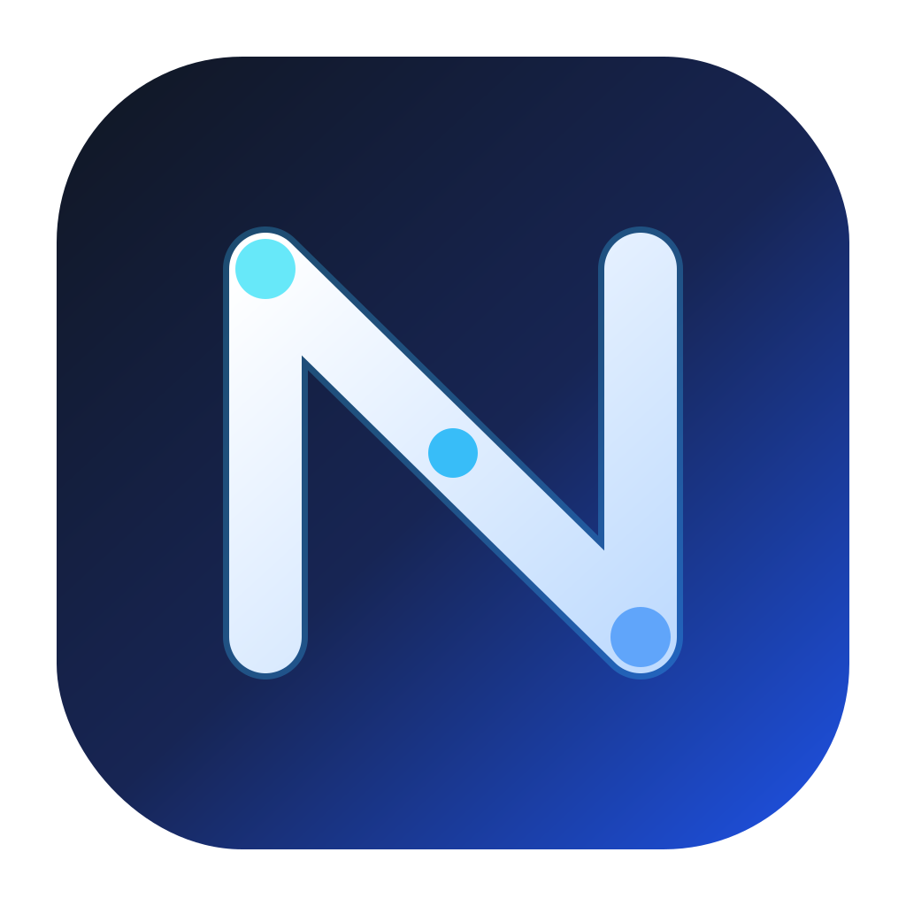
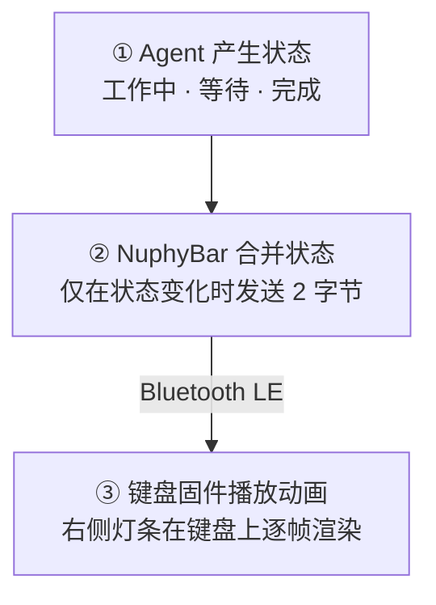

<p align="center">
  
</p>

<h1 align="center">NuphyBar</h1>

<p align="center">让 NuPhy 键盘侧灯显示本机 AI Agent 的工作状态。</p>

<p align="center">
  <a href="README.md">English</a> ·
  <a href="https://github.com/itsmaiGe/NuphyBar/releases/latest">下载最新版</a> ·
  <a href="https://x.com/Samoye">作者麦格</a>
</p>

NuphyBar 是一个轻量的原生 macOS 菜单栏应用。它接收 Codex、Claude Code、OpenCode 等 Agent 的生命周期事件，通过蓝牙键盘已有的标准 HID 指示灯输出报告发送状态，再由定制键盘固件在本地渲染侧灯动画。

它不会读取按键内容，也不会持续向键盘传输动画帧。Mac 只在状态改变时发送一个两字节报告；动画全部在键盘本地运行。

> [!IMPORTANT]
> 当前 Release 中的键盘固件 **只适用于 NuPhy Air60 V2 ANSI**。不要把 Air60 V2 固件刷进 Air75 V2、Air96 V2、Halo、Gem80 或任何其他型号。刷错型号可能让键盘无法正常工作。

## 当前效果

| Agent 状态 | Air60 V2 右侧灯条 |
|---|---|
| 空闲 | 不覆盖，恢复原厂彩虹/电量显示 |
| 工作中 | 单一蓝色系明暗波浪，沿五颗灯连续循环 |
| 等待批准/错误 | 琥珀色五格双脉冲 |
| 完成 | 绿色五格呼吸 |

Caps Lock 的左侧青色提示保持原样。Agent 状态只占用右侧灯条。

## 键盘兼容性

### 已完成并经过实机验证

| 型号 | 连接 | 状态 | 灯光区域 |
|---|---|---|---|
| **Air60 V2 ANSI** | Bluetooth Low Energy | 正式支持 | 右侧五颗 RGB 灯 |

已验证内容包括蓝牙输入、Caps Lock 左灯、工作/等待/完成/空闲状态、断开重连以及长时间打字稳定性。

### 可以移植，但必须制作对应型号的专用固件

| 型号 | 预计难度 | 原因 |
|---|---:|---|
| **Air75 V2** | 低至中 | 同属 Air V2 QMK 系列，具有相同职责的左右侧灯 |
| **Air96 V2** | 低至中 | 同属 Air V2 QMK 系列；NuPhy 官方固件已经使用 Num Lock 控制右侧灯 |

这两款可以复用 NuphyBar 的 HID 状态协议和灯效模型，但必须重新确认各自的 LED 索引、函数地址、固件基线和内存布局。**Air60 V2 的 `.bin` 不能直接刷入。**

### 可以实现 Agent 状态灯，但需要重新设计专属灯效

| 型号 | 可使用的灯光 | 说明 |
|---|---|---|
| Halo65 V2 QMK | Halolight / 铭牌灯 | 不是五格侧灯，需要环形或分区动画 |
| Halo75 V2 QMK | Halolight / 铭牌灯 | 需要型号专用固件和效果 |
| Halo96 V2 QMK | Halolight / 右侧灯 | 官方固件已有 Num Lock 右侧灯逻辑，协议路径可信 |
| Gem80 三模版 | RGB 灯条 / 铭牌灯 | 只考虑带蓝牙的三模版 |

### 当前不支持

- Air V1、Halo V1、Field75 等旧 NuPhy 固件型号；
- Air60 HE、Air75 HE、Field75 HE 等 HE/IO 型号；
- Air V3、Halo V2 IO、Kick75 IO、BH65 等 NuPhy IO 产品；
- Gem80 纯有线版（NuphyBar 当前只实现 BLE HID 输出）。

NuPhy IO 与 QMK 是不同固件体系。硬件上“有灯”不代表能直接使用本项目的 QMK 补丁。型号判断依据见 [NuPhy 官方固件页面](https://nuphy.com/pages/firmware) 和 [QMK 固件发布页](https://nuphy.com/pages/qmk-firmwares)。

## 工作原理

NuphyBar 把整个过程拆成三步。Mac 只传递“当前是什么状态”，动画本身由键盘生成。



| 部分 | 负责什么 | 不做什么 |
|---|---|---|
| Agent Hook | 把任务生命周期事件写成本地状态 | 不直接控制键盘 |
| NuphyBar | 聚合多个会话，并在显示状态改变时发送一次报告 | 不连续发送动画帧 |
| 键盘固件 | 把状态变成波浪、双脉冲或呼吸动画 | 不读取 Agent 内容 |

换句话说，蓝牙上传输的是“工作中”，而不是“第一颗灯亮、第二颗灯亮……”这样的每一帧。

### 一个字节如何表示状态

NuphyBar 没有给蓝牙增加私有 GATT 服务，而是复用键盘本来就支持的标准 LED Output Report：

| HID 位 | 数值 | NuphyBar 用途 |
|---|---:|---|
| Num Lock | `0x01` | 工作中 |
| Caps Lock | `0x02` | 保留给原厂左侧 Caps 指示 |
| Scroll Lock | `0x04` | 等待批准/错误 |
| Num + Scroll | `0x05` | 完成 |
| 无 Num/Scroll | `0x00` | 空闲，恢复原厂灯效 |

完整报告只有两个字节：`[Report ID 1, 状态掩码]`。Caps Lock 位会独立叠加，因此左侧功能不会被 Agent 状态破坏。

只有 Num 与 Scroll 两个可用位，所以目前只能可靠表达三个非空闲状态。错误与等待批准共用琥珀色提醒；如果要增加独立错误灯，必须设计新的无线通信协议，不能继续只靠这两个标准位。

### 为什么不会影响打字

早期实验曾通过蓝牙连续传输动画帧，真实键盘出现过灯条冻结和停止输入。正式方案不再这样做：

- NuphyBar 只有在最终状态变化时才发送一次 HID 报告；
- 键盘仍使用官方原有无线轮询频率；
- 波浪、双脉冲和呼吸全部由键盘本地定时器生成。

因此蓝牙通道只偶尔接收一个状态值，不承载灯效帧率；打字路径与动画路径相互独立。

## Air60 V2 正式固件实现

当前 `stable-v7` 固件不是重新编译一整套旧 QMK，而是在 NuPhy 官方 Air60 V2 v2.1.5 固件上应用经过审计的最小补丁：

- 官方基线 SHA-256：`cd0425f548a01416d1c3c25208ff74867fffd20165520c7c2eaa56000ff347bf`
- NuphyBar 固件 SHA-256：`c573c7939a53994b50f29313744f27f9af30b90cd064f13fc019f87710b89ac0`
- 官方区域只在 `0x080028EA–0x080028ED` 修改 4 字节；
- 这 4 字节把原来的 `sys_led_show()` 调用改为跳转到 `0x08010E00` 的 NuphyBar Hook；
- Hook 首先调用原版 `sys_led_show()`，保留 Caps Lock；
- USB 模式与空闲状态立即返回，不覆盖原厂逻辑；
- 新增灯效代码 332 字节，不占用 `.data` 或 `.bss`；
- 不修改 UART、RF 轮询、按键报告、睡眠、配对和 USB 输入逻辑；
- 构建器会验证关键官方函数的机器码签名，基线不匹配时拒绝生成固件；
- 验证器确认除 4 字节调用点和追加 Hook 外，官方固件逐字不变。

完整源码、构建脚本和测试位于 [`firmware/air60-v2`](firmware/air60-v2)。

> [!NOTE]
> Agent 活跃时右侧灯条用于显示 Agent 状态，因此会暂时覆盖右侧电量显示；回到空闲后恢复原厂电量/彩虹效果。不要在长任务期间只依赖右侧灯判断电量。

## 安装 NuphyBar

要求：

- macOS 14 或更高版本；
- Apple Silicon Mac；
- 已刷入兼容固件的 NuPhy 蓝牙键盘；
- 键盘通过 Bluetooth Low Energy 连接，而不是 USB。

步骤：

1. 从 [Releases](https://github.com/itsmaiGe/NuphyBar/releases/latest) 下载 `NuphyBar-0.5.8-macOS-arm64.dmg`。
2. 打开 DMG，将 NuphyBar 拖入“应用程序”。
3. 首次启动如果 macOS 拦截，右键应用选择“打开”，或到“系统设置 → 隐私与安全性”确认打开。
4. 按应用提示，在“输入监控”中允许 NuphyBar。这个权限用于向键盘 HID 接口写入状态；应用不会读取或保存按键。
5. 重新打开 NuphyBar，在“键盘”页面确认具体型号和“蓝牙已连接”。
6. 在“Agent”页面接入需要的工具，然后重新开始对应 Agent 任务。

当前 DMG 使用 ad-hoc 签名，尚未使用 Apple Developer ID 公证。源码、构建脚本和 Release 校验值全部公开。

## Agent 接入

| Agent | 接入方式 | 主要事件 |
|---|---|---|
| Codex | `~/.codex/hooks.json` | 提交提示、权限请求、工具结束、任务停止 |
| Claude Code | `~/.claude/settings.json` | 提示、权限、需输入通知、工具结束、会话结束 |
| OpenCode | 全局本地插件 | busy、idle、error、permission |
| Grok Build | 个人 Hooks 文件 | 提示、工具、失败、权限、停止 |
| Hermes | 本地生命周期插件 | LLM 调用、批准、会话完成 |
| OpenClaw | 本地托管 Hook | 收到消息、发送结果、停止 |

安装器只修改自己拥有或明确标记的配置片段；遇到同名用户文件会拒绝覆盖。Codex 第一次运行新 Hook 时仍需要用户在 Codex 内确认信任。

状态聚合优先级为：

```text
错误/等待 > 工作中 > 完成 > 空闲
```

多个 Agent 同时运行时，一个会话完成不会错误地盖住另一个仍在工作的会话。完成状态保留约 15 秒，过期的活动会话会自动清理。

## 刷入 Air60 V2 固件

推荐先阅读 [`firmware/air60-v2/README.md`](firmware/air60-v2/README.md)。核心步骤如下：

1. 确认型号是 **NuPhy Air60 V2 ANSI**。
2. 在 VIA 中导出当前键位配置。
3. 从 Release 下载 `NuphyBar-Air60-V2-stable-v7.bin`，并核对 SHA-256。
4. 同时准备 [NuPhy 官方 Air60 V2 v2.1.5 恢复固件](https://nuphy.com/pages/qmk-firmwares)。
5. 使用 USB 连接键盘并进入 STM32 DFU。NuPhy/QMK 源码给出的方式是按住左上角 Esc 再插入 USB；也可以按照 [NuPhy 官方更新说明](https://nuphy.com/pages/update-instructions) 操作。
6. 在 [QMK Toolbox](https://github.com/qmk/qmk_toolbox/releases) 选择正确 `.bin` 并刷写。刷写过程中不要拔线或断电。
7. 重启键盘、切回蓝牙，先验证输入和 Caps Lock，再启动 NuphyBar 测试各状态。

高级用户可以在确认系统只检测到目标 STM32 DFU 设备后使用：

```bash
dfu-util -a 0 -s 0x08000000:leave -D NuphyBar-Air60-V2-stable-v7.bin
```

刷写是有风险的不可逆操作节点。不要让脚本根据设备名称猜测型号，也不要在没有官方恢复固件时开始。

## 从源码构建 App

要求：macOS 14+ 和 Swift 6.1 工具链。

```bash
git clone https://github.com/itsmaiGe/NuphyBar.git
cd NuphyBar
swift test
./script/package_release.sh
```

生成文件位于 `dist/NuphyBar-0.5.8-macOS-arm64.dmg`。

本地构建并运行：

```bash
./script/build_and_run.sh
```

## 从源码重建固件

安装工具：

```bash
brew install arm-none-eabi-gcc@8 arm-none-eabi-binutils dfu-util
```

从 NuPhy 官方下载 Air60 V2 ANSI v2.1.5 固件后运行：

```bash
./firmware/air60-v2/build.sh \
  /path/to/QMK_firmware_nuphy_air60_v2_ansi_v2.1.5.bin
```

构建过程会先运行灯效和 Thumb 跳转编码测试，再校验官方基线、编译 Hook、添加 DFU 后缀并验证最终布局。使用 GCC 8.5.0 时应逐字生成 Release 中的 `stable-v7` 文件。

## 让 Codex / Claude Code 帮你适配或刷固件

仓库提供了可以直接交给本地编码 Agent 的任务模板和安全检查点：

- [中文：让 AI 编写、移植和刷写固件](docs/AI_FIRMWARE_GUIDE.zh-CN.md)
- [English: AI-assisted firmware porting and flashing](docs/AI_FIRMWARE_GUIDE.en.md)

核心原则是：AI 可以检查源码、编写效果、运行测试和编译固件；**进入 DFU、确认准确型号和最终执行刷写必须是独立的人工确认节点。**

## 隐私与安全

- NuphyBar 不读取、记录或上传按键内容；
- Hook 只传递 Agent 类型、粗粒度状态和本地会话标识；
- 状态文件保存在本机，不包含提示词和回复内容；
- 不使用云服务、统计 SDK 或后台网络接口；
- Agent 配置修改会保留其他用户配置，并拒绝覆盖未标记的同名文件。

安全问题请参考 [`SECURITY.md`](SECURITY.md)，不要在公开 Issue 中提交敏感配置。

## 项目结构

```text
Sources/
  AgentLightApp/      macOS 菜单栏 App 与设置界面
  AgentLightCore/     Agent 状态聚合、Hook 映射与接入安装器
  AgentLightHID/      NuPhy BLE HID 设备发现与 Output Report
  AgentLightCLI/      App 内置的短生命周期 Hook helper
firmware/air60-v2/    Air60 V2 stable-v7 Hook、构建器与测试
Design/               NuphyBar App 和菜单栏 Logo 源文件
script/               App 构建、运行和 DMG 打包脚本
Tests/                Swift 测试
```

## License

- macOS App、构建脚本和普通项目文档：[`MIT`](LICENSE)
- `firmware/` 中基于 QMK/NuPhy 固件的补丁和源码：[`GPL-2.0-or-later`](firmware/LICENSE-GPL-2.0-or-later.md)
- 第三方 Agent 图标和商标属于各自权利人，仅用于标识接入，参见 [`THIRD_PARTY_NOTICES.md`](THIRD_PARTY_NOTICES.md)。

NuphyBar 是社区项目，与 NuPhy、OpenAI、Anthropic 及其他 Agent 厂商无隶属或背书关系。
