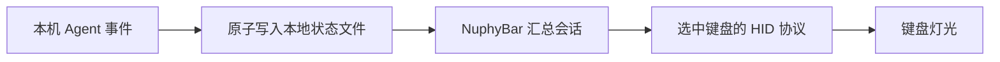

<p align="center">
  
</p>

<h1 align="center">NuphyBar</h1>

<p align="center">看一眼键盘，就知道本机 AI Agent 在做什么。</p>

<p align="center">
  <a href="README.md">English</a> ·
  <a href="https://github.com/itsmaiGe/NuphyBar/releases">下载与版本</a> ·
  <a href="https://x.com/Samoye">作者麦格</a>
</p>

NuphyBar 是一个轻量的原生 macOS 菜单栏应用。它汇总 Codex、Claude Code 等本机 Agent 的生命周期事件，用兼容键盘的灯光显示工作、等待确认、完成和错误状态。NuPhy 的动画由键盘固件生成；AULA F99 Pro 使用原厂固件显示整键纯色背光。

应用不读取按键，不保存提示词或回复，也不向服务器发送数据。

## 先选对版本

| 版本 | 包含的功能 |
|---|---|
| [已发布的 v0.5.9](https://github.com/itsmaiGe/NuphyBar/releases/tag/v0.5.9) | Air60 V2 ANSI 蓝牙支持；提供 macOS 安装包和 `stable-v7` 固件 |
| 当前源码，应用版本 0.5.13 | 新增 Halo75 V2 ANSI USB／蓝牙、AULA F99 Pro 蓝牙、更细的状态和恢复诊断；需要自行构建 |

**v0.5.9 下载包不包含 Halo75 和 AULA 的新增功能。** 新机型的贡献者实测记录与待完成验证见下文。源码合并不代表已经发布新版安装包。

## 键盘兼容性

| 准确型号 | 连接方式 | 固件要求 | 灯光区域 | 验证状态 |
|---|---|---|---|---|
| NuPhy Air60 V2 ANSI | 低功耗蓝牙 BLE | NuphyBar `stable-v7` | 右侧五颗 LED | 已发布，已实机验证 |
| NuPhy Halo75 V2 ANSI **QMK** | USB Raw HID | Halo75 专用固件 | 左上角五颗 LED | 实验性，贡献者已做实测 |
| NuPhy Halo75 V2 ANSI **QMK** | 低功耗蓝牙 BLE | Halo75 专用固件 | 左上角五颗 LED | 实验性，核心功能和恢复已由贡献者实测 |
| AULA F99 Pro，设备名 `AULA-F99Pro 5.0` | 低功耗蓝牙 BLE | 原厂固件 | 整键 RGB 背光 | 实验性，已在贡献者的对应设备上测试 |

> [!IMPORTANT]
> 固件必须匹配准确型号和布局。**Air60 固件不能刷到 Halo、其他 Air 尺寸或 ISO 键盘上。** NuPhy IO 与 QMK 是不同的固件体系。AULA 的这项功能不需要刷自定义固件。

当前未实现 Air75 V2、Air96 V2、其他 Halo 尺寸、Gem80、Air／Halo V1、HE 和 NuPhy IO 机型。不支持 2.4 GHz 接收器；Air60 和 AULA 的灯光控制仅支持蓝牙。

应用同时控制一台选中的键盘。连接多台兼容设备时，优先级为 Halo USB、Halo 蓝牙、Air60 蓝牙、AULA 蓝牙。蓝牙设备名本身不能证明 NuPhy 已安装自定义固件。

## 开始使用

系统要求：**macOS 14 或更新版本**；提供的安装包与打包流程面向 **Apple Silicon Mac**。

1. Air60 用户可以下载 [v0.5.9 安装包](https://github.com/itsmaiGe/NuphyBar/releases/tag/v0.5.9)。Halo75 或 AULA 用户需要[构建当前源码](#构建与测试)。
2. 将 `NuphyBar.app` 放入“应用程序”。应用使用 ad-hoc 签名，尚未经过 Developer ID 公证；首次启动如被拦截，使用“打开”，并按“系统设置 → 隐私与安全性”中的提示批准。
3. 按提示允许**输入监控**，然后重新打开应用。该权限用于访问键盘 HID 接口；NuphyBar 不注册按键读取回调。
4. 用支持的模式连接准确型号的键盘。NuPhy 需要安装[对应固件](#键盘固件)，AULA 使用原厂固件。
5. 打开菜单栏应用的**键盘**页，确认识别到的型号和连接状态。
6. 在 **Agent** 页启用接入。Codex 提示时，审核并信任新安装的 hooks，然后开始一个新任务。

从旧版升级后，关闭再重新启用 Codex 接入，以安装当前的事件定义。变更后的 hooks 需要在 Codex 中重新审核；NuphyBar 不会替你授予信任。

## 灯光含义

| 状态 | Air60 蓝牙 | Halo75 蓝牙 | Halo75 USB | AULA 蓝牙 |
|---|---|---|---|---|
| 空闲 | 原厂灯效 | 原厂灯效 | 原厂灯效 | 原厂灯效 |
| 工作／思考 | 蓝色流光 | 红色慢呼吸 | 红色慢呼吸 | 红色常亮 |
| 执行工具 | 蓝色流光 | 红色慢呼吸 | 红色常亮 | 红色常亮 |
| 输出文字 | 蓝色流光 | 红色慢呼吸 | 黄色慢呼吸 | 黄色常亮 |
| 等待授权 | 琥珀色双脉冲 | 蓝色快呼吸 | 蓝色快呼吸 | 蓝色常亮 |
| 完成 | 绿色呼吸 | 绿色常亮 | 绿色常亮 | 绿色常亮 |
| 错误 | 琥珀色双脉冲 | 蓝色快呼吸 | 红色快闪 | 红色常亮 |

这是协议能够显示的状态；实际自动触发取决于 Agent 暴露的事件。普通 Codex hooks 不提供流式文字增量，因此**“输出文字”可由协议和 CLI 使用，但不会从工具结束事件推断出来**。

当前安装的 Codex hooks 将提交提示词、工具结束映射为工作中，将工具开始映射为执行工具，将授权请求映射为等待，将 `Stop` 映射为完成；`SessionEnd` 会移除对应会话。参见[官方 hooks 文档](https://learn.chatgpt.com/docs/hooks)。

多个会话并行时，显示优先级为：`错误 > 等待 > 执行工具 > 输出文字 > 工作中 > 完成 > 空闲`。一个会话完成不会盖住另一个仍在工作的会话。完成和错误提示约 15 秒后过期，之后由其余会话决定灯光。

## Agent 接入

| Agent | 接入位置 | 使用的事件 |
|---|---|---|
| Codex | `~/.codex/hooks.json` | 提示词、工具开始／结束、授权、停止、会话结束 |
| Claude Code | `~/.claude/settings.json` | 提示词、工具、授权、需要输入的通知、会话结束 |
| Antigravity | `~/.gemini/config/plugins/nuphybar` | 调用、完全空闲、错误 |
| OpenCode | 全局本地插件 | 忙碌、空闲、错误、授权 |
| Grok Build | 个人 hooks 文件 | 提示词、工具、失败、授权、停止 |
| Hermes | 本地生命周期插件 | 模型调用、审批、完成 |
| OpenClaw | 受管理的本地 hook | 收到消息、发送结果、停止 |

安装器保留无关配置，遇到没有 NuphyBar 标记的同名插件文件时会拒绝覆盖。接入需要在本机运行、并支持对应 hooks 或插件的 Agent。

## 工作方式


```mermaid
flowchart LR
    A[本机 Agent 事件] --> B[原子写入本地状态文件]
    B --> C[NuphyBar 汇总会话]
    C --> D[选中键盘的 HID 协议]
    D --> E[键盘灯光]
```

应用在收到状态变化通知时读取 `~/Library/Application Support/AgentLight/state-v2.json`，并每五秒检查一次，以弥补遗漏通知。完成和错误由过期定时器清理。设备发现和写入共用一个长期运行、非独占的 HID 管理器；连接标识防止旧回调或旧写入结果影响新连接。

各连接方式分别处理：

- **NuPhy 蓝牙：**状态变化或连接恢复时发送两字节标准 LED 报告。Num Lock 和 Scroll Lock 位编码工作、等待／错误、完成和空闲；Caps Lock 单独保留。
- **Halo USB：**状态变化时发送带校验的 32 字节 Raw HID 报告。活动状态每五分钟续发一次，早于固件的 15 分钟超时；空闲和终态不周期续发。
- **AULA 蓝牙：**使用 20 字节原厂实时颜色命令。原厂模式约两秒后失效，所以活动期间每秒刷新一次。空闲时仅发送一次恢复原厂灯效命令，不使用会持久写入配置的路径，也不控制独立右侧灯条。

应用不传输动画帧。Air60 保留原有 Caps Lock 指示灯；Halo 的电量、Caps Lock、配对和睡眠提示在 Agent 灯效之后绘制，保持更高优先级。Air60 工作期间，右侧 Agent 灯效会暂时替代电量提示。

NuPhy 在系统唤醒或报告失败后重建连接，并以受控间隔重试。AULA 在安全输入、屏幕休眠或系统休眠期间暂停写入，条件恢复后继续显示最新状态；其他写入拒绝按 30 秒间隔重试。屏幕休眠不会删除任务记录。

## 验证情况与已知限制

贡献者报告已完成 Halo USB／蓝牙状态、打字、Caps Lock、键盘断电重连和跨日唤醒使用测试。AULA 的记录覆盖实时颜色、重连、持续刷新，以及一次受控安全输入暂停。详细记录和日期见 [Halo 恢复验证](docs/recovery-validation.md)与 [AULA 验证](docs/aula-recovery-validation.md)。

新机型全面发布前仍有以下待验证项：

- 十次受控 Mac 睡眠／唤醒，以及二十次实机重连。
- Halo BLE2／BLE3 切换，以及最终完整 USB 状态、VIA 和空闲恢复回归。
- 记录准确时长的实机耐久测试；模拟小时数和重连次数不等于实机验证。

活动任务没有时间上限，以便长任务持续显示灯光。如果 Agent 被中断或崩溃，却没有发出对应结束事件，活动记录可能残留。当前未实现自动中断状态核对；`SessionEnd` 不等同于每一轮任务的停止事件，状态格式也尚未用 turn ID 拒绝乱序事件。

损坏的状态文件会保留并报错，不会静默覆盖。在**键盘 → 恢复诊断 → 导出**可保存有数量上限的本地日志，包含连接变化和发送结果。日志中的会话／轮次标识经过哈希处理，不记录提示词、对话正文或工具内容。HID 写入成功仅代表 macOS 接受报告，不代表已经观测到实机 LED。

## 构建与测试

使用 Swift 6.1 或更新版本，以及匹配的 macOS SDK：

```bash
git clone https://github.com/itsmaiGe/NuphyBar.git
cd NuphyBar
swift test
swift build -c release
./firmware/air60-v2/test.sh
./firmware/halo75-v2-ansi/test.sh
./script/package_release.sh
```

Swift 包包含 `AgentLightCore` 库、`agent-light` 辅助程序和 `NuphyBar` 应用。当前打包输出为 `dist/NuphyBar-0.5.13-macOS-arm64.dmg`。只构建应用可运行 `./script/build_app.sh`；需要安装并启动时使用 `./script/build_and_run.sh`。

如果 Command Line Tools 默认 SDK 缺少 SwiftUI 宏插件，可用 `swift test --sdk /path/to/MacOSX.sdk` 指定已安装且兼容的 SDK，并在 release 构建时使用相同 SDK。这属于工具链配置问题，无需为此删除应用中的 SwiftUI 状态代码。

## 键盘固件

- **Air60 V2 ANSI：**[`firmware/air60-v2`](firmware/air60-v2/README.md) 提供 `stable-v7` 补丁、基线检查、可复现构建和验证工具。固件 SHA-256 为 `c573c7939a53994b50f29313744f27f9af30b90cd064f13fc019f87710b89ac0`。新增机型没有修改这份固件。
- **Halo75 V2 ANSI QMK：**[`firmware/halo75-v2-ansi`](firmware/halo75-v2-ansi/README.md) 提供独立源码补丁、准确上游版本、恢复固件哈希、构建方法和验证状态。输出名为 `NuphyBar-Halo75-V2-ANSI.bin`，不能用 Air60 文件替代。
- **AULA F99 Pro：**保留原厂固件；本功能只发送临时颜色命令。

刷写 NuPhy 前，必须确认型号和 ANSI 布局、导出 VIA 键位、准备匹配的官方恢复固件，并核对哈希。构建不会自动刷写。可参考[中文](docs/AI_FIRMWARE_GUIDE.zh-CN.md)／[英文](docs/AI_FIRMWARE_GUIDE.en.md)固件指南及 [NuPhy 更新说明](https://nuphy.com/pages/update-instructions)。

## 贡献与许可

[CONTRIBUTING.md](CONTRIBUTING.md) 列出了检查命令和新机型移植所需证据。新型号必须具有独立的准确设备配置、固件基线、灯效和实机验证。

应用代码、普通脚本和文档使用 [MIT](LICENSE)；QMK／NuPhy 衍生固件使用 [GPL-2.0-or-later](firmware/LICENSE-GPL-2.0-or-later.md)。品牌素材归原权利人所有，见[第三方声明](THIRD_PARTY_NOTICES.md)；隐私与问题报告见 [SECURITY.md](SECURITY.md)。

NuphyBar 是社区项目，与 NuPhy、AULA、OpenAI、Anthropic 等厂商没有隶属或官方背书关系。
